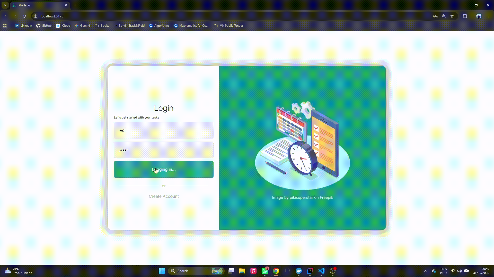

# 🚀 Task Manager

A full-stack task management application built with **Spring Boot** and **React**, featuring user authentication with JWT, task management, PostgreSQL persistence, and a layered architecture inspired by **DDD (Domain-Driven Design)** principles.

## 📷 Preview



---

## ✨ Features

### Authentication
- User registration
- User login
- JWT-based authentication
- Protected routes

### Task Management
- Create tasks
- Update tasks
- Delete tasks
- Mark tasks as completed
- View personal tasks
- Input validation

---

## 🏗️ Architecture

The backend follows a layered architecture inspired by Domain-Driven Design (DDD):

```
API Layer
│
├── Controllers
├── DTOs
├── Mappers
│
Application Layer
│
├── Services
├── Commands
├── Application DTOs
│
Domain Layer
│
├── Entities
├── Repository Contracts
├── Business Rules
│
Infrastructure Layer
│
├── JPA Repositories
├── Security
├── Database
└── External Integrations
```

---

## 🛠️ Technologies

### Backend

- Java 25
- Spring Boot 3
- Spring Security
- Spring Data JPA
- JWT Authentication
- PostgreSQL
- Maven
- Docker
- Lombok
- Bean Validation
- JUnit 5
- Mockito

### Frontend

- React 19
- TypeScript
- React Router
- React Query
- Axios
- Vite
- Lucide React

---

## 📂 Project Structure

```
task-manager/
│
├── backend/
│   └── task-manager/
│
├── frontend/
│
└── README.md
```

---

# ⚙️ Backend Setup

## Prerequisites

- Java 25+
- Maven 3.9+
- PostgreSQL
- Docker (optional)

---

## Environment Variables

Create the following environment variables:

```env
POSTGRE_USERNAME=postgres
POSTGRES_PASSWORD=password
JWT_SECRET=your-secret-key
```

---

## Database Configuration

The application expects PostgreSQL running on:

```properties
jdbc:postgresql://localhost:5432/postgres
```

Default configuration:

```properties
spring.datasource.url=jdbc:postgresql://localhost:5432/postgres
spring.jpa.hibernate.ddl-auto=update
```

---

## Run Backend

Navigate to:

```bash
cd backend/task-manager
```

Start the application:

```bash
./mvnw spring-boot:run
```

Or:

```bash
mvn spring-boot:run
```

The API will be available at:

```text
http://localhost:8080
```

---

# 💻 Frontend Setup

Navigate to:

```bash
cd frontend
```

Install dependencies:

```bash
npm install
```

Run development server:

```bash
npm run dev
```

Frontend URL:

```text
http://localhost:5173
```

---

# 🔐 Authentication Endpoints

## Register

```http
POST /auth/register
```

Request:

```json
{
  "name": "John Doe",
  "email": "john@email.com",
  "password": "123456"
}
```

---

## Login

```http
POST /auth/login
```

Request:

```json
{
  "email": "john@email.com",
  "password": "123456"
}
```

Response:

```json
{
  "token": "jwt-token"
}
```

---

# 📋 Task Endpoints

## Get All Tasks

```http
GET /task
```

---

## Get Current User Tasks

```http
GET /task/my-tasks
```

---

## Create Task

```http
POST /task/create
```

Request:

```json
{
  "title": "Study Spring Boot",
  "description": "Finish the authentication module"
}
```

---

## Update Task

```http
PUT /task/{id}
```

---

## Toggle Task Status

```http
PUT /task/{id}/status
```

---

## Delete Task

```http
DELETE /task/{id}
```

---

# 🧪 Testing

Run backend tests:

```bash
mvn test
```

The project uses:

- JUnit 5
- Mockito
- Spring Security Test

---

# 🐳 Docker

You can containerize the application using Docker.

Example:

```bash
docker compose up -d
```

---

# 🚀 Future Improvements

- Task categories
- Task priorities
- Due dates
- Dashboard with statistics
- Email notifications
- Refresh token support
- Pagination
- Swagger/OpenAPI documentation

---

# 👨‍💻 Author

**Vítor Lougon**

Java Developer passionate about software architecture, backend development, and scalable applications.

- GitHub: https://github.com/your-user
- LinkedIn: https://linkedin.com/in/your-profile

---

# 📄 License

This project is licensed under the MIT License.
